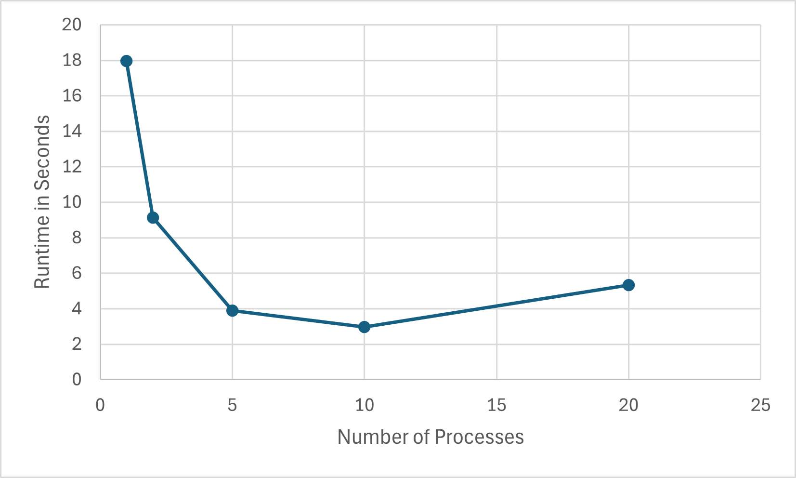
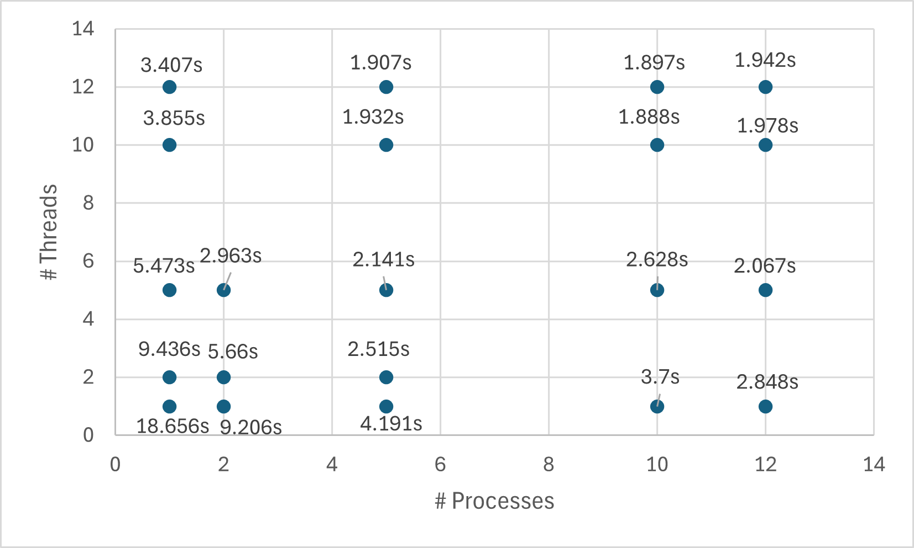

# System Programming Lab 11 Multiprocessing
## Vincent Vassallo
## CPE 2600 Section 111
## Overview
Single process was completed using a for loop to create all 50 images with slight decrements in scale between them.

Multiple processes used forks nested in a for loop in order to create all the necessary processes to create images. Using the ratio of images/processes, each process was given a specific image to create and the necessary decrement to subtract from the starting xscale and to create the y scale.

In order to name the files properly, a temporary string was created in order to copy from outfile excluding the file extension. As the program iterates it concatenates the number of the image and the missing extension back on the temp and sends it off to be saved.

### Runtime Results

### Discussion

**All testing was done using the same parameters to create the same set of 50 images**

The results make seem accurate. As more processes are added, the work is divided up more and more across the processor cores and the runtimes reduce. However as the number of processes surpass the number of cores in my machine, it slows substantially.

# System Programming Lab 12 Multithreading
## Overview
To implement multithreading, code from compute_image was moved to a new function named compute_thread so that the threads could be called to run that specific function. A struct named imageinfo was created to hold all the variables needed to run to run compute_thread. 

In compute_image, an array of this struct and another of threads are created, then the variables are put into the struct per desired thread and passed into a pthread_create. After a for loop executes to join the threads.

Inside compute_thread, the variables are extracted from the struct. Then using the id of the thread, various calculations are made to determine the amount of pixels it will handle. Nested for loops then modify the pixels.

### Runtime Results

### Discussion

**All testing was done using the same parameters to create the same set of 50 images**

Based on the results from the graph, it seems that the runtime is more largely affected by multithreading, as it shows that at higher amounts of processes and threads, having more threads than processes is faster. I believe this is because as the number of processes surpass the number of cores in your machine, you experience drops in efficiency. Whereas with multithreading, you can get away with running many more with diminishing returns, rather than drops in efficiency, to a farther point.

The "sweet spot" of processes to threads seems to be around 10 processes and 10 threads. However, I am sure this can be optimized with more experimentation.

